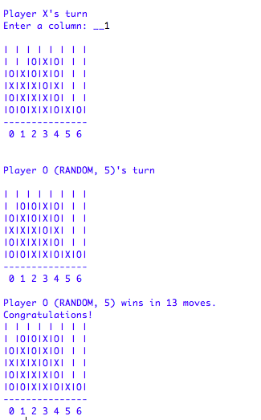

# Connect Four Project
This Python project immitates the "connect four" board game. 
There are 3 different set ups for this game, as you can chose to play with a friend (player vs player mode), with a randomized computer or with an AI algorithm. 

## Table of contents
* [General info](#general-info)
* [Screenshots](#screenshots)
* [Technologies](#technologies)
* [Setup](#setup)
* [Features](#features)
* [Status](#status)
* [Inspiration](#inspiration)
* [Contact](#contact)

## General info
There are 4 files in this project, each creating a different part of the game. 

The first one creates a board for the game, the second one creates a player, so that you could make your move. Third one, the "Game" itself, immitates the process of taking turns to play the game, and the last one creates an AI player, that makes a move consciencly, predicting other player's move. 

The algorithm of this AI player is based on recursion and searching for the best move with the highest "score" of winning. Each move it counts the score for each column for each best move of the player. 
There is also a parameter that you can chose for AI Player indicating how it will make its move if the chances of winning for two columns are the same. The computer may always chose right or left column, or do it rendomly. 

The code also takes into account the borders of the board, so that, like in a real board game, you count't win if you had 3 checkers in a row to the right of the table and 1 on the same line but in the left corner. 

## Screenshots

_An example of a situation where AI Players wins_

## Technologies
* Python - version 3.6.2

## Setup
Download all 4 files and run Module from the last file - *AIPlayer*. Enter one of the modes, as shown in Code Examples further below and start playing! 

## Code Examples
Here are some examples of how one can start a game in Python Shell:

* Player vs Player mode 
`connect_four(Player('X'), Player('O'))`
* Player vs Random Computer 
`connect_four(Player('X'), RandomPlayer('O'))`
* Player vs AI Player
`connect_four(Player('X'), AIPlayer('O', 'RANDOM', 5))`
where the second parameter of the AI Players indicates how it makes a decision when the odds of winning is the same for 2 columns (choices are: 'RANDOM', 'RIGHT', 'LEFT') and the third parameter is the number of moves it thinks ahead

## Features
* Player vs Player mode 
* Player vs Random Player 
* Player vs AI Player

To-do list:
* Create a more user friendly way of playing without using Python Shell for the game. 

## Status
Project is: _finished_

## Contact
Created by Ekaterina Gorbunova - feel free to contact me at eginfo@bu.edu!
